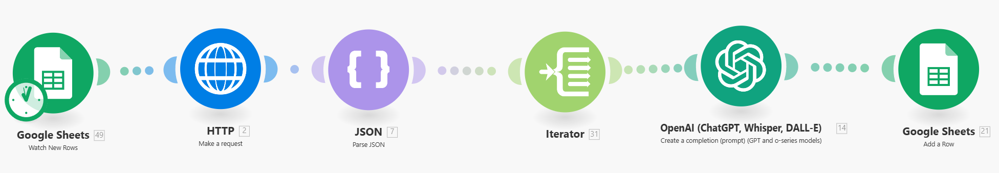

# Make 발표자료 - 홍승준

- 이 서비스를 왜 만들게 되었나요?
    
    처음 가는 동네에 도착했는데 어떤 시설이 있는지 궁금하거나, 뭘 해야 할지 궁금할 때 사용
    
- 어떤 모듈을 사용해서 만들었나요?
    
    Google Sheets
    
    HTTP
    
    JSON
    
    Flow Control (Iterator)
    
    OpenAI
    
    Google docs
    
    Mail (Naver)
    
- 서비스 동작의 흐름 - 0
    
    
    
    
    
    
    
    
    
- 서비스 동작의 흐름 - 1
    
    
    
    1. Google Form 과 연결된 Google Sheets가 새로운 응답을 감지합니다.
        
        
        
    2. HTTP가 Kakao API를 이용해 사용자가 요청한 것을 가져옵니다,
        
        
        
    3. Parse JSON
        
        
        
        이렇게 INPUT된 값을 Parse JSON을 통해 
        
        
        
        깔끔하게 정리합니다.
        
    4. Iterator를 이용해 
        
        
        
        OpenAI가 4개 컬렉션을 하나씩 순차적으로 감지하게 합니다.
        
        (Iterator를 사용하지 않으면 Collection 1번만 4번 감지합니다.)
        
        
        
        - Iterator의 OUTPUT 값
        
    5. OpenAI를 이용한 후기 정리
        
        
        
        OpenAI를 이용해 후기를 정리합니다. 한국 사람들은 후기에 예민하거든요
        
        Bundle이 4개이므로 4개의 각기 다른 답변이 출력됩니다.
        
    
    1. Google Sheet Add a row
        
        
        
        기능을 이용해 출력 값을 구글 시트에 기록합니다.
        
    
- 서비스 동작의 흐름 - 2
    
    
    
    1. Google Docs 문서를 생성한 후 앞서 Add a Row 작업을 실행한 Sheet를 Search합니다.
    
    1. 확인된 Row들을 생성한 문서에 삽입합니다.
        
        
        
        이렇게 요청하면 Sheet를 참조해
        
        
        
        이렇게 담기게 됩니다.
        
        여러 개의 다른 답변을 한 개의 문서로 모으는 작업입니다.
        
- 서비스 동작의 흐름 -3
    
    
    
    1. 위의 7번 자료에서 Create Document를 했기 때문에 Watch Documents에서 새로 생성한 문서가 탐지가 됩니다.
    
    1. Get Content of a Document를 통해 8에서 진행했던 작업의 내용을 가져옵니다.
        
        
        
    2. Search Rows
        
        
        
        요청한 고객에게 메일을 전송해야 되기 때문에
        
        구글 폼에 기록된 고객의 메일 주소를 가져옵니다.
        
    3. 고객에게 이메일을 전송합니다.
        
        
        
        SMTP 설정 및 연결 후 수신자에게는 11번에서 작업한 고객의 이메일, 그리고 내용에는 평문으로 10번에서 가져온 문서의 내용을 입력합니다.
        
        
        
        잘 도착합니다.
        
    
- 서비스 동작의 흐름 -4
    
    
    
    1. 사후 관리를 위해 답변한 내용을 복사하여 다른 시트에 백업합니다.
    
    1. 다른 고객에게 이전 고객의 요청 사항이 도착하면 안되므로 시트를 비웁니다.
- 어떤 시행착오가 있었는지
    
    
    
    - 분명 INPUT은 5개일텐데 필터에만 10개가 잡히는 점 (40개까지 잡아 봤습니다.)
    
    
    
    - 똑같은 가게만 여러 번 적히는 점 (Timestamp 다르게 들어간 다른 작업인데 내용이 같음)
    
    
    
    - 앞에서 반복 작업이 들어가면 뒷 순서의 모든 작업이 그 횟수만큼 반복된다는 것을 알았습니다. 메일 30통 받아봤습니다.
    
- 배운 점, 개선할 점 혹은 느낀 점
    - Make 정말 넓게 활용하면 상당히 편리하고 간편한 도구 같아서 프로젝트 후에도 다뤄볼 것 같습니다.
    - 오류 발생 시 어디서 잘못됐는지 그리고 Run This Module 등을 실행하여 천천히 분석해 보아야겠다 라고 생각이 들었습니다.
    - 한눈에 잘 보이지가 않았습니다.
    - **한 시나리오에 모든 내용을 담을 필요는 없다고 느꼈습니다.**
    - 저장을 활성화합시다.
    - 크레딧을 아껴씁니다.