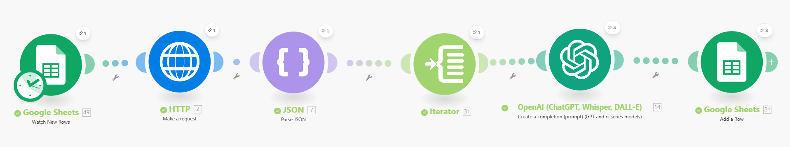
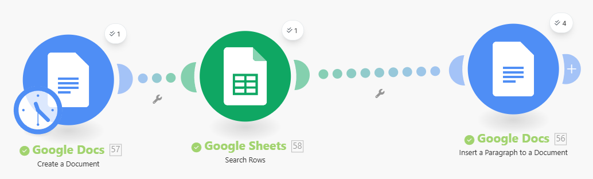
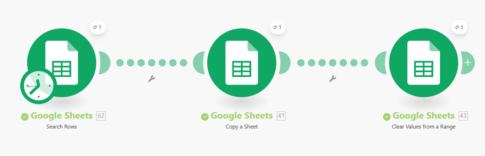
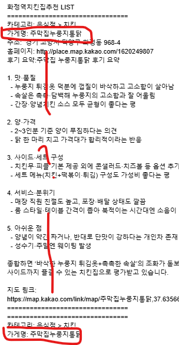

# 🚀 Make를 이용한 지역 편의시설 및 정보 안내 사무자동화 (홍승준)

> 사용자 요청(Google Form) 수신부터 Kakao API 및 OpenAI 연동, Google Docs 보고서 통합 생성, Naver SMTP 이메일 자동 발송, 데이터 백업 및 초기화까지 **전 과정을 자동화한 Make 기반 워크플로우 프로젝트**입니다.

---

## 📑 목차
- [1. 프로젝트 개요](#1-프로젝트-개요)
- [2. 사용 기술 및 모듈 (Tech Stack)](#2-사용-기술-및-모듈-tech-stack)
- [3. 서비스 동작 흐름 (4개 시나리오 연계 구조)](#3-서비스-동작-흐름-4개-시나리오-연계-구조)
  - [[시나리오 1] 장소 정보 수집 및 AI 요약](#시나리오-1-장소-정보-수집-및-ai-요약)
  - [[시나리오 2] 통합 보고서 생성 (Google Docs)](#시나리오-2-통합-보고서-생성-google-docs)
  - [[시나리오 3] 이메일 자동 발송 (Naver SMTP)](#시나리오-3-이메일-자동-발송-naver-smtp)
  - [[시나리오 4] 데이터 사후 관리 및 시트 초기화](#시나리오-4-데이터-사후-관리-및-시트-초기화)
- [4. 주요 시행착오 및 문제 해결 (Troubleshooting)](#4-주요-시행착오-및-문제-해결-troubleshooting)
- [5. 배운 점 및 핵심 교훈](#5-배운-점-및-핵심-교훈)
- [6. 사무 관리 직무 적용점 및 기대 효과](#6-사무-관리-직무-적용점-및-기대-효과)

---

## 1. 프로젝트 개요
* **기획 배경**: 처음 방문한 지역에서 필요한 시설이나 추천 장소를 찾는 사용자의 요청을 수신하고, 관련 정보를 자동 수집·정제하여 이메일 보고서로 신속하게 안내하는 시스템을 구현했습니다.
* **핵심 목표**: 
  - 수동 조사 및 이메일 작성 시간을 단축하여 **사무 행정 생산성 향상**
  - 고객 요청 데이터의 **이력 관리 및 보안(이전 응답 섞임 방지)** 강화

---

## 2. 사용 기술 및 모듈 (Tech Stack)
* **Google Sheets**: 폼 응답 감지, 임시 데이터 수집, 데이터 백업 및 초기화
* **HTTP**: Kakao API 호출 (장소 및 편의시설 데이터 수집)
* **JSON (Parse JSON)**: API 응답 데이터 구조화 및 파싱
* **Flow Control (Iterator)**: 다중 컬렉션 데이터의 순차적 반복 처리
* **OpenAI (ChatGPT)**: 후기 및 장소 정보 요약 정제
* **Google Docs**: 통합 수신용 안내 보고서 문서 자동 생성
* **Mail (Naver SMTP)**: 최종 고객 맞춤 이메일 발송

---

## 3. 서비스 동작 흐름 (4개 시나리오 연계 구조)

> 💡 **시나리오 분리 설계**: 
> 한 시나리오에 모든 로직을 담을 경우 발생할 수 있는 무한 루프, 이메일 중복 발송, 크레딧 오남용을 방지하기 위해 **총 4개의 독립된 시나리오로 분리하여 연계 동작**하도록 설계했습니다.

---

### [시나리오 1] 장소 정보 수집 및 AI 요약

1. **Google Sheets (Watch Responses)**: Google Form과 연결된 구글 시트에서 새로운 요청을 감지합니다.
   

2. **HTTP (Kakao API)**: 요청된 장소 정보를 Kakao API를 통해 수집합니다.
   

3. **Parse JSON**: API 응답 데이터(JSON)를 파싱하여 보기 쉽게 정형화합니다.
   
   

4. **Iterator (Flow Control)**: Kakao API 추출 데이터 중 4개 컬렉션을 하나씩 순차적으로 전달합니다.  
   *(Iterator 미사용 시 Collection 1번만 4회 반복 감지되는 현상을 방지)*
   
   

5. **OpenAI**: 파싱된 후기 데이터 및 정보들을 읽기 쉽게 요약합니다. Bundle별로 4개의 개별 답변이 생성됩니다.
   

6. **Google Sheets (Add a row)**: 정제된 답변 결과를 구글 시트에 기록합니다.
   

---

### [시나리오 2] 통합 보고서 생성 (Google Docs)

1. **Google Docs (Create Document)**: 결과물을 모아 담을 신규 Google Docs 문서를 생성합니다.
2. **Google Sheets (Search Rows)**: 앞서 기록된 시트 데이터를 조회합니다.
3. **Insert Text to Document**: 조회된 여러 개별 답변들을 새로 생성된 Docs 문서 한 곳으로 통합하여 입력합니다.
   
   

---

### [시나리오 3] 이메일 자동 발송 (Naver SMTP)

1. **Watch Documents**: 새로 생성된 Google Docs 문서를 감지합니다.
2. **Get Content of a Document**: 통합 완성된 문서 내부 텍스트 콘텐츠를 가져옵니다.
   

3. **Google Sheets (Search Rows)**: 요청 고객에게 발송하기 위해 구글 폼 응답 시트에서 이메일 주소를 조회합니다.
   

4. **Send an Email (Naver SMTP)**: 수신자 주소로 문서 내용을 본문에 담아 안내 이메일을 자동 발송합니다.
   
   

---

### [시나리오 4] 데이터 사후 관리 및 시트 초기화

1. **데이터 백업 (Copy to Backup Sheet)**: 사후 관리 및 이력 조회를 위해 답변 완료된 데이터를 별도 백업 시트로 복사합니다.
2. **시트 초기화 (Clear Sheet)**: 다음 고객 요청 시 이전 요청자의 데이터가 섞이거나 남아있지 않도록 사용 완료된 임시 시트를 비웁니다.

---

## 4. 주요 시행착오 및 문제 해결 (Troubleshooting)

1. **필터 감지 건수 폭증 현상**
   - **문제**: INPUT 데이터는 5개인데 필터 상에서 10개~40개까지 불필요하게 반복 감지되는 현상 발생.
   - **원인 및 해결**: 모듈 간 흐름 제어 미비 원인을 파악하고, Iterator 및 데이터 처리 범위를 정밀하게 지정하여 해결.
   - 

2. **동일 정보 중복 기재 문제**
   - **문제**: 타임스탬프가 다른 별개의 작업임에도 동일한 장소 정보만 반복 기재됨.
   - **해결**: 데이터 매핑 조건을 수정하고 Bundle 단위 처리 방식을 재설정하여 고유 데이터가 반영되도록 조치.
   - 
   - 

3. **연쇄 반복으로 인한 이메일 대량 발송 (메일 30통 연쇄 발송)**
   - **문제**: 선행 모듈의 반복 구조(Iterator)로 인해 후속 이메일 발송 모듈까지 횟수만큼 연쇄 실행되어 동일 메일이 30통 넘게 수신됨.
   - **해결**: 단일 시나리오의 한계를 인지하고, **시나리오를 4단계로 분리하여 Google Sheets/Docs를 중간 매개체로 활용**함으로써 중복 루프를 완전히 차단함.
   - 
   - 
   - 
   - 

---

## 5. 배운 점 및 핵심 교훈
- **시나리오 모듈화의 중요성**: **"한 시나리오에 모든 기능을 담을 필요가 없다"**는 것을 깨달았습니다. 기능별로 시나리오를 분리하면 오류 추적이 쉬워지고 무한 루프 등 치명적 장애를 예방할 수 있습니다.
- **체계적인 디버깅 방식**: 에러 발생 시 `Run This Module` 기능과 각 모듈의 Output 로그를 단계별로 검증하는 체계적 원인 분석 습관을 길렀습니다.
- **자원 관리 의식**: 비효율적인 모듈 루프를 개선함으로써 API 크레딧 오남용을 줄이고 실행 속도를 최적화했습니다.

---

## 6. 사무 관리 직무 적용점 및 기대 효과
* **업무 효율화**: 수동 검색 및 개별 보고서/메일 작성에 건당 15~20분 소요되던 업무를 **1분 이내 완전 자동화**
* **적용 가능 범위**:
  - 고객 문의 자동 분류 및 안내문 발송
  - 거래처 및 시장 조사 데이터 수집 및 정기 보고서 통합 생성
  - 비품 신청 및 내부 요청건 처리 자동화